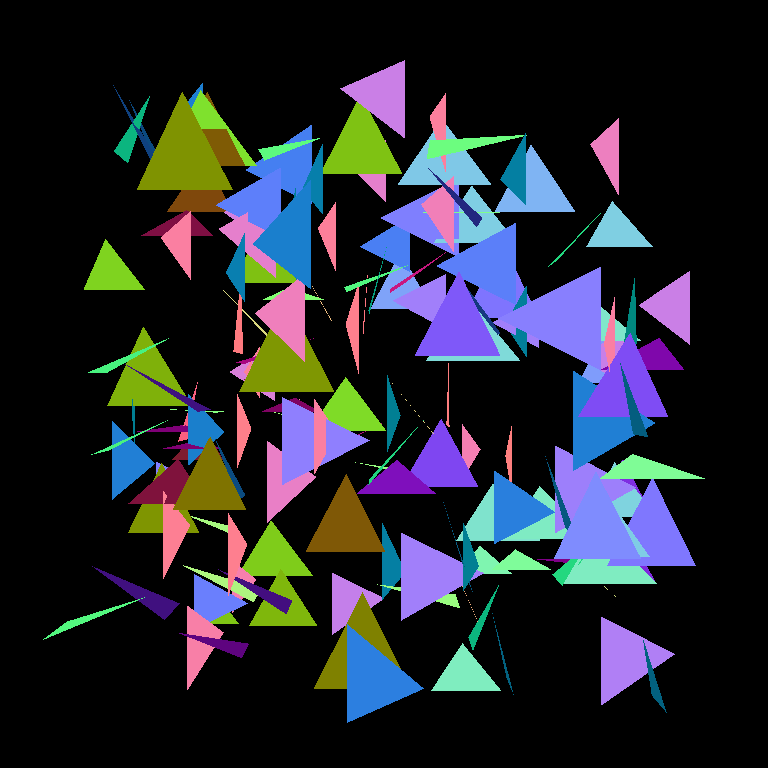
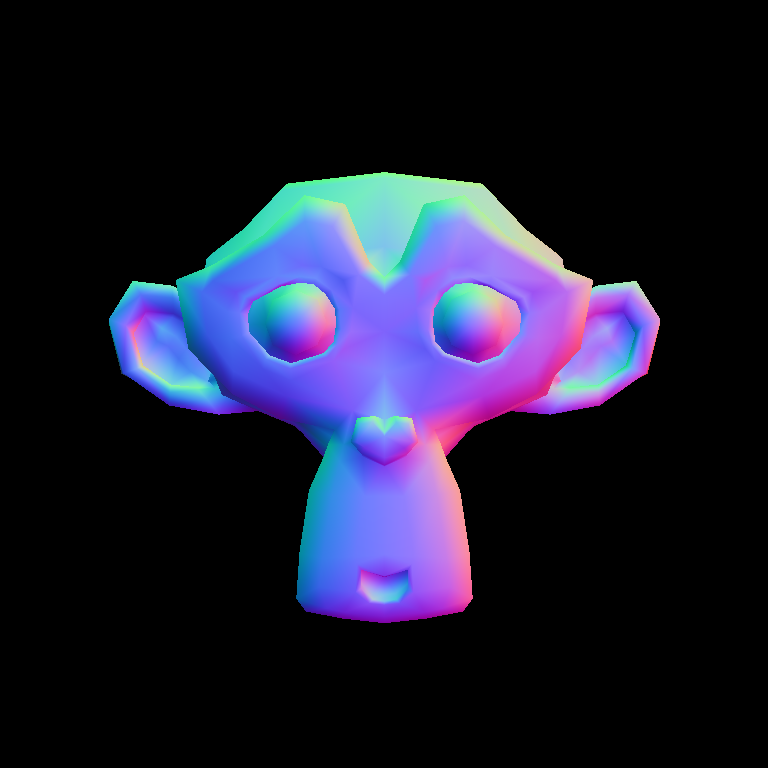
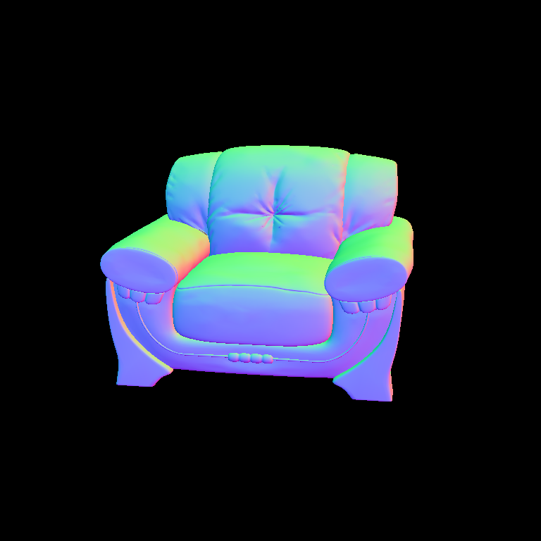

# Atividade II - Teste de Intersecção Raio-Triângulo

O algoritmo selecionado foi o Moller-Trumbore por ser simples e de facil implementação. Branches no algoritmo foram removidas e subtituidas por um ínico branch para simplificar o codigo. Nesse estagio é calculado as coordenadas baricentricas do ponto de itersecção para gerar vectores normais suavizados.

```rust
fn intersect(&self, ray: &Ray) -> Option<IntersectionRecord> {
        let oa = ray.origin.coords - self.vert[0].pos;
        let e1 = self.vert[1].pos - self.vert[0].pos;
        let e2 = self.vert[2].pos - self.vert[0].pos;

        let p = ray.direction.cross(&e2);
        let q = oa.cross(&e1);

        let inv = 1.0 / p.dot(&e1);

        let t = inv * q.dot(&e2);
        let u = inv * p.dot(&oa);
        let v = inv * q.dot(&ray.direction);

        if u < 0.0 || u > 1.0 || v < 0.0 || u + v > 1.0 || t < 0.0 {
            None
        } else {
            let w = 1.0 - u - v;

            let normal =
                (w * self.vert[0].nrm 
                + u * self.vert[1].nrm 
                + v * self.vert[2].nrm)
                .normalize();

            Some(IntersectionRecord { t, normal })
        }
    }
```

Todas as primitivas utilizam da mesma interface ( traits em Rust )

```rust
#[derive(Clone)]
pub struct IntersectionRecord {
    pub t: f64,
    pub normal: Vector3<f64>,
}

pub trait Primitive {
    fn intersect(&self, ray: &Ray) -> Option<IntersectionRecord>;
}
```

Vertices possuem sua posiçao e vector normal, opcionalment pode haver as coordenas UV para texturas
```rust
#[derive(Debug, Clone, Copy)]
pub struct Vertex {
    pub pos: Vector3<f64>,
    pub nrm: Vector3<f64>,
    // pub tcd: Vector2<f64>,
}
```

Triangulo são apenas um vector de vectices
```rust
#[derive(Clone)]
pub struct Triangle {
    pub vert: Vec<Vertex>,
}
```

O numero de vertices é verificado no construtor de um triângulo
```rust
impl Triangle {
    pub fn new(v: &Vec<Vertex>) -> Triangle {
        debug_assert!(v.len() == 3);

        Triangle { vert: v.clone() }
    }
}
```

## Testes

### Triângulos aletoriamente distribuidos (158 tris, 1.4s)



### Blender Suzanne  (967 tris, 9s)



### Sofa (53,343 tris, 13.4min) 


Arquivo .blend por [Zero4mike](https://blendswap.com/blend/10179)