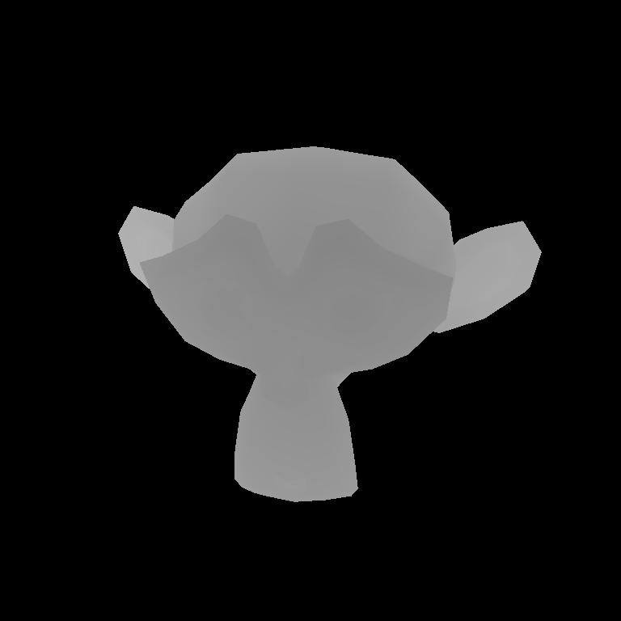
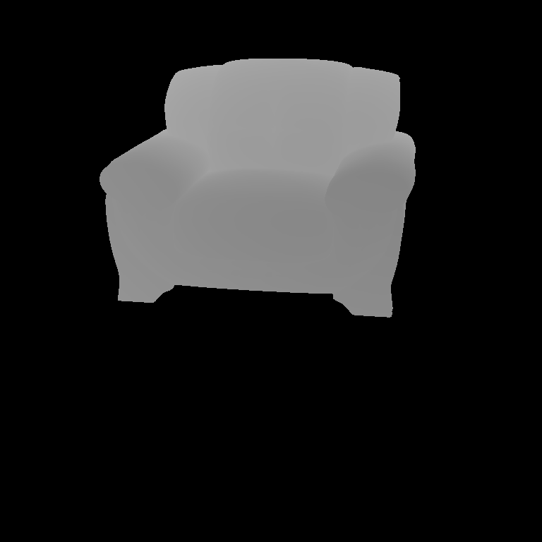

# Atividade III - Câmeras com Posiçâo/Direção Arbitrárias e Câmera Perspectiva

## Camera Perspectiva

A aplicação utiliza como biblioteca de algebra [nalgebra](https://nalgebra.org/) que possui varios tipos/estruturas e metodos especificos para algebra linear que propocionam semanticas extras para que o usuário saiba constantemente exatamente que tipo de objeto algébrico está sendo manipulado.

A camera perspectica possui dimensioes, fov (field of view) e um ```Isometry3``` que é uma translanção seguido de rotação.
```rust
pub struct Camera {
    pub isometry: Isometry3<f64>,
    pub img_dimensions: Vector2<u32>,
    pub fov: f64,
}
```

Hà varios modos de criar um Isometry, o que foi usado é ```Isometry3::look_at_rh()``` que cria uma matrix de mão direita.
```rust
    pub fn new(
        origin: &Point3<f64>,
        direction: &Vector3<f64>,
        img_dimensions: Vector2<u32>,
        fov: f64,
    ) -> Camera {
        Camera {
            isometry: Isometry3::look_at_rh(
                origin, 
                &(origin + direction), 
                &Vector3::y_axis()),
            img_dimensions: img_dimensions,
            fov,
        }
    }
```

### Geração de Raios

Transformação de espaços de ```(i..img_width)``` para ```(-ratio..ratio)``` e
```(i..img_height)``` para ```(-1.0..1.0)```.

```rust
    pub fn img_ratio(&self) -> f64 {
        self.img_dimensions.x as f64 / self.img_dimensions.y as f64
    }

    pub fn to_screen_space(&self, i: u32, j: u32) -> Vector2<f64> {
        let ratio = self.img_ratio();

        Vector2::<f64>::new(
            ((i as f64 / self.img_dimensions.x as f64) - 0.5) * 2.0 * ratio,
            -((j as f64 / self.img_dimensions.y as f64) - 0.5) * 2.0,
        )
    }
```

Apois a transformação do espaço um ponto no plano da imagem é gerado. Como ```Camera::isometry``` transforma um ponto\vetor para o espaço da camera, a transformação inversa é aplicada para ter o raio no espaço do mundo.

```rust
    pub fn get_ray(&self, i: u32, j: u32) -> Ray {
        let p = self.to_screen_space(i, j);

        let v = Vector3::<f64>::new(
            p.x + random::<f64>() / (self.img_dimensions.x as f64),
            p.y + random::<f64>() / (self.img_dimensions.y as f64),
            -1.0 / (self.fov / 2.0).to_radians().tan(),
        )
        .normalize();

        Ray {
            origin: self.isometry.inverse_transform_point(&Point3::origin()),
            direction: self.isometry.inverse_transform_vector(&v),
        }
    }
```

## Importação de malhas Wavefront (.obj)

Malhas são apenas um conjunto de triângulos e o tipo ```AggregatePrimitive<T: Primitive>``` é uma generalização de um conjunto de primitivas qualquer

```rust
pub struct AggregatePrimitive<T: Primitive> {
    pub primitives: Vec<T>,
}

impl<T: Primitive> AggregatePrimitive<T> {
    pub fn new() -> AggregatePrimitive<T> {
        AggregatePrimitive::<T> {
            primitives: Vec::<T>::new(),
        }
    }
}
```

Na função de intersecção é selecionado a primitiva mais próxima da câmera

```rust
impl<T: Primitive> Primitive for AggregatePrimitive<T> {
    fn intersect(&self, ray: &Ray) -> Option<IntersectionRecord> {
        let mut closest: Option<IntersectionRecord> = None;

        for primitive in self.primitives.iter() {
            if let Some(record) = primitive.intersect(&ray) {
                closest = match &closest {
                    Some(old_record) if old_record.t > record.t => Some(record),
                    Some(_) => closest,
                    None => Some(record),
                }
            }
        }

        closest
    }
}
```

## Exemplos

Renders da distância de cada ponto de intersecção

### Blender Suzanne



### Sofa (53,343 tris)



Arquivo .blend por [Zero4mike](https://blendswap.com/blend/10179)