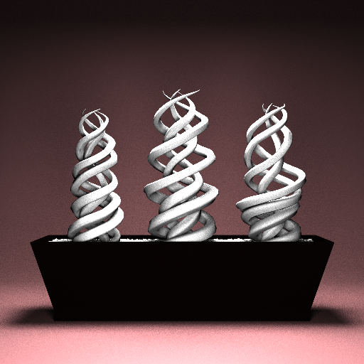
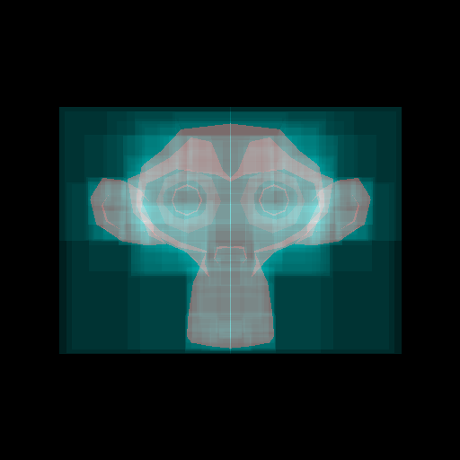
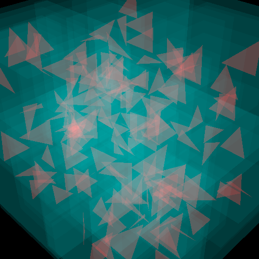
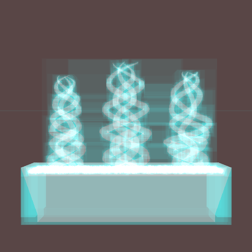
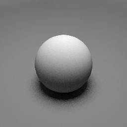
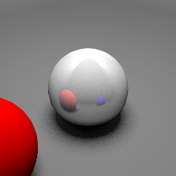
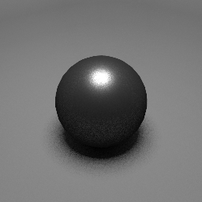
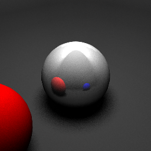

# Trabalho Final



## Amostragem Explícita da Luz


```rust
fn direct_light(s: &sample::SampleRecord, brdf: &Box<dyn BRDF>, scene: &Scene) -> Vector3<f64> {
    let light = scene.get_light();

    let (lp, lpdf) = light.sample_point();

    let lpo = lp - s.o;

    let sr = Ray {
        origin: s.o + s.on * 0.0000000001,
        direction: lpo.normalize(),
    };

    let mut direct = Vector3::<f64>::zeros();

    let res = scene.obj.intersect(&sr);

    if res.is_none() || res.unwrap().t > lpo.norm() {
        let lp2 = s.m * lp;
        let lp2s = lp2 - s.p;
        let lv = lp2s.normalize();
        let ld = lp2s.norm_squared();

        let dot = s.n.dot(&lv).min(1.0).max(0.0);

        let lf = brdf.f(&BRDFInput {
            n: &s.n,
            l: &lv,
            v: &s.v,
        });

        direct = (lf * dot).component_mul(&(light.shade(&s.m, &s.o, &lv) 
          / (lpdf * ld)));
    }

    direct * scene.lights.len() as f64
}
```

Amostragem de luz de área em formato de disco.

```rust
    fn sample_point(&self) -> (Point3<f64>, f64) {
        let sm = sample::onb(&self.pos, &self.normal);

        let theta = 2.0 * PI * random::<f64>();
        let r = self.radius * random::<f64>();

        (
            sm.inverse_transform_point(&Point3::<f64>::new(
                r.sqrt() * theta.cos(),
                r.sqrt() * theta.sin(),
                0.0,
            )),
            1.0 / std::f64::consts::PI * self.radius * self.radius,
        )
    }
```

## Estrutura de aceleração

A estrutura de aceleração é uma BVH simples.








## Materiais

Os materiais são descritos em um aquivo JSON que é carregado junto o modelo .obj

### Diffuse



```json
    "material": {
        "name": "diffuse",
        "color": {
          "r": 0.93,
          "g": 0.93,
          "b": 0.93
        }
      }
```

### Mirror



```json
    "material": {
        "name": "mirror",
        "color": {
          "r": 0.83,
          "g": 0.83,
          "b": 0.83
        }
      }
```

### Microfacet BRDF

O material utiliza a distribuição de GGX, função de mascaramento é uma aproximação do Smith G1 por Brian Karris e a funcção de fresnel é a aproximação de Schlick.




```json
    "material": {
        "name": "microfacet",
        "albedo": {
          "r": 0.1,
          "g": 0.1,
          "b": 0.1
        },
        "f0": {
          "r": 0.8,
          "g": 0.8,
          "b": 0.8
        },
        "roughness": 0.12,
        "specular": 0.97
      }
```


```rust
fn f(&self, input: &BRDFInput) -> Vector3<f64> {
        let h = (input.l + input.v).normalize();

        let num = ggx_ndf(self.roughness, &input.n, &h)
            * ggx_g1(self.roughness, &input.n, &input.v)
            * ggx_g1(self.roughness, &input.n, &input.l)
            * fresnel_schlick(&self.f0, &input.n, &input.l);

        let den = 4.0 * (input.n.dot(&input.l) * input.n.dot(&input.v));

        let s = num / den;

        (self.albedo / PI) + (s * self.specular)
    }
```


```rust
fn ggx_ndf(alpha: f64, n: &Vector3<f64>, m: &Vector3<f64>) -> f64 {
    let alpha2 = alpha * alpha;
    let dot = n.dot(&m);
    let denom = 1.0 + dot * dot * (alpha2 - 1.0);
    (ggx_chi(dot) * alpha2) / (PI * denom * denom)
}
```


<br><br>


```rust
fn ggx_g1(alpha: f64, n: &Vector3<f64>, s: &Vector3<f64>) -> f64 {
    let dot = n.dot(&s);
    (2.0 * dot * ggx_chi(dot)) / ((2.0 - alpha) + alpha)
}
```


```rust
fn fresnel_schlick_scalar(f0: f64, n: &Vector3<f64>, l: &Vector3<f64>) -> f64 {
    f0 + (1.0 - f0) * (1.0 - n.dot(&l)).powf(5.0)
}

fn fresnel_schlick(f0: &Vector3<f64>, n: &Vector3<f64>, l: &Vector3<f64>) -> Vector3<f64> {
    Vector3::<f64>::new(
        fresnel_schlick_scalar(f0[0], &n, &l),
        fresnel_schlick_scalar(f0[1], &n, &l),
        fresnel_schlick_scalar(f0[2], &n, &l),
    )
}
```

## Gamma Correction



Gamma de 2.2 ligado / desligado

